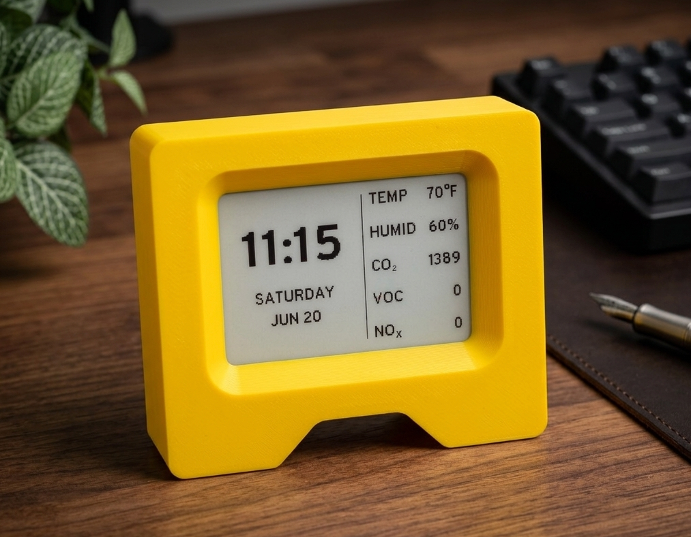

# bitclock-redux

A fork of [goat-hill/bitclock](https://github.com/goat-hill/bitclock) — an open-source e-ink desk clock and air quality monitor. This fork replaces the Bluetooth/BLE configurator with an on-device web admin and removes the weather feature to make it a clock-only device.

**Changes from upstream:**
- **Web admin** at `http://bitclock.local` — configure Wi-Fi, timezone, NTP server, and OTA firmware updates from any browser; no app or Bluetooth required
- **AP provisioning** — on first boot (or after a failed Wi-Fi connection), the device broadcasts a `bitclock-setup` Wi-Fi network with a setup page at `192.168.4.1`
- **Sensor readings on the clock face** — temperature, humidity, CO₂, VOC index, and NOx index displayed across the top of the display
- **MQTT + Home Assistant** — publishes all sensor readings to an MQTT broker; auto-discovery creates entities in Home Assistant automatically
- **BLE removed** — no Bluetooth stack; smaller firmware image
- **Weather removed** — clock-only device

## Flashing

### First install (USB)

Download `bitclock-redux-full-<version>.bin` from the [latest release](https://github.com/ccmpbll/bitclock-redux/releases/latest) and flash it at offset `0x0` using the [Espressif web flasher](https://espressif.github.io/esptool-js/) or [Adafruit WebSerial ESPTool
](https://adafruit.github.io/Adafruit_WebSerial_ESPTool/). The ESP32-S3 has native USB — no driver needed (shows as `/dev/cu.usbmodem*` on macOS).

### OTA update

Download `bitclock-redux-app-<version>.bin` from the [latest release](https://github.com/ccmpbll/bitclock-redux/releases/latest) and upload it via the web admin at `http://bitclock.local` → Firmware Update.

## Setup

1. On first boot, connect to the `bitclock-setup` Wi-Fi network
2. Open `http://192.168.4.1` in a browser and enter your Wi-Fi credentials
3. The device reboots into your network and is accessible at `http://bitclock.local`

## Sensor readings

Five values are displayed on the clock face and in the web admin:

| Reading | What it means |
|---|---|
| **Temp** | Ambient temperature (°C or °F) |
| **Humidity** | Relative humidity (%) |
| **CO₂** | Carbon dioxide in ppm. Fresh air is ~400 ppm; above 1000 ppm feels stuffy. Sensor range: 400–2000 ppm (±50 ppm + 5%). |
| **VOC** | Volatile organic compound index, relative to a rolling 24-hour baseline. **100** = baseline; **above 100** = air quality worsening (odors, fumes); **below 100** = cleaner than baseline. |
| **NOₓ** | Nitrogen oxide index. **1** = clean air; **above 1** = combustion byproducts detected (gas stove, smoke). |

## MQTT and Home Assistant

Bitclock can publish sensor readings to an MQTT broker and auto-discover itself in Home Assistant.

### Setup

1. In the web admin (`http://bitclock.local`), open the **MQTT** section
2. Enter your broker host, port (default 1883), and credentials if required
3. Set a topic prefix (default `bitclock`) and publish interval (default 30s)
4. Click **Save MQTT**

### Home Assistant

With the [MQTT integration](https://www.home-assistant.io/integrations/mqtt/) enabled in Home Assistant (discovery on by default), Bitclock will appear automatically as a device with 5 entities:

| Entity | Topic | Unit |
|---|---|---|
| Temperature | `bitclock/temp` | °C or °F (follows web admin setting) |
| Humidity | `bitclock/humidity` | % |
| CO₂ | `bitclock/co2` | ppm |
| VOC Index | `bitclock/voc` | — |
| NOx Index | `bitclock/nox` | — |

Discovery config topics are published with `retain=1` on connect, so Home Assistant picks them up even if it was offline when the device connected. Changing the temperature unit in the web admin updates the HA entity unit automatically on the next reconnect.

## Case

A 3D-printable case is available on [Printables](https://www.printables.com/model/1759743-bitclock-redux-case). STL and STEP files are also included in the [`case/`](case/) directory.

## Supported hardware

**PCB rev3a only** — the first and only commercially sold revision of the bitclock hardware (ESP32-S3, e-ink display). Earlier prototype revisions (rev1 ESP32-C3, Seeed ESP32-S3) are not supported by this fork and their build targets have been removed.

## Cloning

This repo uses git submodules.

```sh
git clone --recursive https://github.com/ccmpbll/bitclock-redux.git
```

If already cloned without `--recursive`:

```sh
git submodule init && git submodule update
```

## License

MIT — same as upstream. Original work by [goat-hill](https://github.com/goat-hill/bitclock).
